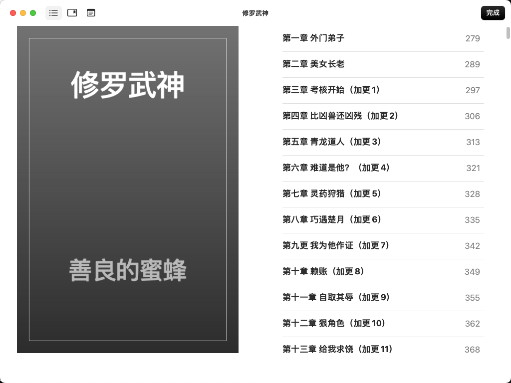

# novel_spider

[English](README_EN.md) | 中文

**novel_spider** 是一个基于 Python 的 17k 小说网爬虫与电子书导出项目，支持一键采集、断点续爬、反爬虫自动切换、数据导出为 txt/epub，推荐使用统一入口脚本 `run.py`。

## 🚀 功能特性

本项目主要包含以下功能：

1. **一键自动采集小说榜单、章节、内容**
   - 通过 `run.py` 脚本，支持如下命令：
     - `python run.py crawl auto_novel_top100`
     - `python run.py crawl auto_novel_top100_postgre`
   - 自动抓取 17k 小说网 VIP 榜单前 100 名小说的基本信息、章节列表及所有章节内容，支持断点续爬、反爬虫自动切换 Selenium。
   - 数据存入 `output/novel_data.db`（SQLite）或 PostgreSQL（自动检测 settings.py）。

2. **一键导出小说为 txt/epub**
   - 通过 `run.py` 脚本，支持如下命令：
     - `python run.py export txt`
     - `python run.py export epub`
   - 自动从数据库导出所有小说为 txt 或 epub 文件，支持章节号智能排序、中文数字识别、作者信息导出。

3. **数据库自动适配**
   - 自动检测 `seventeen_novels/settings.py`，优先用 PostgreSQL，否则用 SQLite。
   - 数据表结构自动创建，支持 upsert。

4. **章节号智能排序与中文数字识别**
   - 导出时自动识别章节号，支持"第十二章""第100章"等混合排序。
   - 支持中文数字转阿拉伯数字，章节顺序准确。

5. **环境与依赖自动管理**
   - 自动检测并激活虚拟环境。
   - ChromeDriver 自动管理，无需手动下载。
   - 跨平台支持（Windows/macOS/Linux）。

6. **反爬虫自动切换与断点续爬**
   - 遇到反爬页面自动切换 Selenium。
   - 已采集章节自动跳过，支持大规模数据采集。

7. **智能日志系统与错误处理**
   - 结构化日志输出，包含时间戳和操作状态。
   - 详细的错误信息和故障排除提示。
   - 优雅的错误处理，不会因单个错误导致程序崩溃。

8. **Docker 容器化支持**
   - 提供完整的 Dockerfile 和 docker-compose.yml。
   - 支持一键部署和运行。
   - 镜像优化，包含 Chrome 和 ChromeDriver。

9. **多种爬虫模式**
   - `auto_novel_top100`: 支持 Sqlite 自动爬取 免费 榜单前 100 名小说
   - `auto_novel_top100_postgre`: 支持 PostgreSQL 的自动爬取模式
   - `free_novel_top100`: 免费小说榜单爬取
   - `novel_chapter_list`: 章节列表爬取
   - `novel_all_chapters`: 全章节内容爬取

10. **统一入口脚本**
    - 所有功能通过 `run.py` 统一管理。
    - 支持命令行参数和帮助信息。
    - 其他入口脚本已被整合，不再推荐单独使用。

## 📁 目录结构

```
novel_spider/
├── seventeen_novels/           # Scrapy 爬虫主模块
│   ├── items.py               # 数据模型定义
│   ├── pipelines.py           # 数据处理管道
│   ├── settings.py            # 爬虫配置
│   ├── middlewares.py         # 中间件
│   └── spiders/               # 爬虫脚本
│       ├── auto_novel_top100.py
│       ├── auto_novel_top100_postgre.py
│       ├── free_novel_top100.py
│       ├── novel_chapter_list.py
│       └── novel_all_chapters.py
├── output/                     # 所有数据输出目录
│   ├── novel_data.db           # SQLite 数据库
│   ├── ebooks/                 # 导出的 txt/epub 文件
│   └── pgdata/                 # PostgreSQL 数据目录
├── run.py                      # 一键入口脚本（推荐）
├── run_export_to_ebooks.py     # 电子书导出脚本
├── requirements.txt            # Python 依赖
├── Dockerfile                  # Docker 镜像配置
├── docker-compose.yml          # Docker Compose 配置
├── sample.env                  # 环境变量示例
├── scrapy.cfg                  # Scrapy 配置文件
└── README.md                   # 项目说明文档
```

## 📦 依赖说明

### 核心依赖
- **scrapy>=2.13.2**: 爬虫框架
- **selenium>=4.33.0**: 浏览器自动化
- **webdriver_manager>=4.0.2**: ChromeDriver 自动管理
- **parsel>=1.10.0**: HTML/XML 解析
- **ebooklib>=0.19**: EPUB 电子书生成
- **psycopg2-binary>=2.9.10**: PostgreSQL 数据库连接

### 系统要求
- **Python**: 3.13.3 及以上版本
- **Chrome 浏览器**: 用于 Selenium 自动化
- **内存**: 建议 4GB 以上
- **存储**: 根据采集数据量，建议 10GB 以上可用空间

## 🔧 安装与环境准备

### 1. 克隆项目
```bash
git clone https://github.com/WTFGEDelphia/novel_spider.git
cd novel_spider
git checkout main
```

### 2. 安装 Python 环境

推荐 Python 3.13.3 及以上版本。

**Windows：**
1. 访问 [Python 官网下载页面](https://www.python.org/downloads/windows/)。
2. 下载最新的 Python 3 安装包（.exe）。
3. 双击运行安装包，**务必勾选"Add Python to PATH"**，然后点击"Install Now"。
4. 安装完成后，在命令行输入 `python --version` 或 `py --version` 验证安装。

**macOS：**
1. 推荐使用 Homebrew 安装：
   ```bash
   brew install python
   ```
2. 或前往 [Python 官网下载页面](https://www.python.org/downloads/macos/) 下载 `.pkg` 安装包并安装。
3. 安装完成后，在终端输入 `python3 --version` 验证安装。

**Linux（以 Ubuntu/Debian 为例）：**
1. 系统通常自带 Python3，可通过以下命令安装/升级：
   ```bash
   sudo apt update
   sudo apt install python3 python3-venv python3-pip
   ```
2. 验证安装：
   ```bash
   python3 --version
   ```

### 3. 创建虚拟环境并安装依赖

**Windows**
```cmd
py -m venv venv
venv\Scripts\activate
pip install -r requirements.txt
```

**macOS / Linux**
```bash
python3 -m venv venv
source venv/bin/activate
pip install -r requirements.txt
```

### 4. 配置 Chrome 浏览器与驱动
- 本项目自动使用 `webdriver_manager` 管理 ChromeDriver，无需手动下载。
- 需本地已安装 Chrome 浏览器。

## ⚙️ 环境变量与数据库配置

### PostgreSQL 配置（可选）
1. 复制环境变量示例文件：
   ```bash
   cp sample.env .env
   ```

2. 编辑 `.env` 文件，设置数据库连接参数：
   ```bash
   PG_HOST=localhost
   PG_PORT=5432
   PG_USER=postgres
   PG_PASSWORD=your_password
   PG_DBNAME=novel_spider
   ```

3. 如果使用 PostgreSQL，确保数据库已创建并可访问。

### SQLite 配置（默认）
- 无需额外配置，数据将自动保存到 `output/novel_data.db`

## 🚀 使用方法

### 1. 一键自动采集小说榜单与内容

```bash
# 使用 SQLite 数据库
python run.py crawl auto_novel_top100

# 使用 PostgreSQL 数据库
python run.py crawl auto_novel_top100_postgre

# 本地模式（跳过榜单采集，直接采集章节内容）
python run.py crawl auto_novel_top100 --local
```

**功能说明：**
- 自动抓取榜单、章节列表、章节内容
- 支持断点续爬，已采集内容自动跳过
- 遇到反爬虫自动切换 Selenium
- 实时显示采集进度和状态

### 2. 一键导出小说为 txt/epub

```bash
# 导出为 TXT 格式
python run.py export txt

# 导出为 EPUB 格式
python run.py export epub
```

**功能说明：**
- 自动从数据库读取所有小说数据
- 支持章节号智能排序
- 中文数字自动转换
- 包含小说名、作者、卷名、章节名、正文

> 💡 **快速预览**：导出完成后，可以直接在 macOS 上双击 EPUB 文件使用"预览"应用打开查看效果，或使用其他 EPUB 阅读器如 Calibre。

## 📖 EPUB 导出效果展示

### macOS 预览效果
导出的 EPUB 文件在 macOS 上使用内置的"预览"应用打开，效果如下：

#### 书籍封面和目录


#### 章节导航


#### 章节内容阅读


### 导出特性
- **完整章节结构**：包含卷名、章节名、正文内容
- **智能排序**：章节按中文数字自动排序
- **作者信息**：完整显示小说作者信息
- **兼容性好**：支持各种 EPUB 阅读器（macOS 预览、Calibre、Kindle 等）

### 3. 查看帮助信息

```bash
# 查看主帮助
python run.py --help

# 查看爬虫帮助
python run.py crawl --help

# 查看导出帮助
python run.py export --help
```

## 🐳 Docker 一键部署与运行

### 1. 构建镜像
```bash
docker build -t novel_spider:latest .
```

### 2. 运行采集/导出命令
```bash
# 采集小说榜单与内容
docker run --rm -v $(pwd)/output:/app/output novel_spider:latest crawl auto_novel_top100

# 导出 epub
docker run --rm -v $(pwd)/output:/app/output novel_spider:latest export epub

# 导出 txt
docker run --rm -v $(pwd)/output:/app/output novel_spider:latest export txt
```

> `-v $(pwd)/output:/app/output` 让容器内的 output 目录与主机同步，方便获取结果。

### 3. Docker Compose 一键部署

**启动 PostgreSQL 和爬虫服务：**
```bash
docker-compose up --build
```

**运行导出命令：**
```bash
docker-compose run --rm spider python run.py export epub
docker-compose run --rm spider python run.py export txt
```

**停止并清理：**
```bash
docker-compose down
```

## 🔍 故障排除

### 常见问题

1. **虚拟环境未找到**
   ```bash
   # 确保在项目根目录下
   python3 -m venv venv
   source venv/bin/activate  # Linux/macOS
   # 或
   venv\Scripts\activate     # Windows
   ```

2. **ChromeDriver 下载失败**
   - 检查网络连接
   - 确保 Chrome 浏览器已安装
   - 尝试手动下载 ChromeDriver 并放入项目目录

3. **数据库连接失败**
   - 检查 PostgreSQL 服务是否启动
   - 验证 `.env` 文件中的连接参数
   - 确保数据库用户有足够权限

4. **爬虫被反爬虫拦截**
   - 项目会自动切换到 Selenium 模式
   - 可以尝试降低爬取频率
   - 检查网络连接稳定性

5. **导出失败**
   - 确保数据库中有数据
   - 检查 `output/ebooks/` 目录权限
   - 验证 EPUB 导出需要 `ebooklib` 依赖

### 日志查看
项目使用结构化日志，所有操作都会记录详细信息：
- 时间戳和操作状态
- 错误信息和堆栈跟踪
- 爬取进度和统计信息

## 📊 输出文件说明

### 数据库文件
- **SQLite**: `output/novel_data.db`
- **PostgreSQL**: 数据存储在配置的数据库中

### 导出文件
- **TXT 文件**: `output/ebooks/*.txt`
- **EPUB 文件**: `output/ebooks/*.epub`

### 文件命名规则
- 文件名：小说名（特殊字符会被过滤）
- 编码：UTF-8
- 格式：包含小说信息、章节内容、作者信息

## 🤝 贡献指南

欢迎提交 Issue 和 Pull Request！

1. Fork 本项目
2. 创建功能分支
3. 提交更改
4. 推送到分支
5. 创建 Pull Request

## 📄 许可证

MIT License

## 📞 联系方式

如需定制化采集或有其他问题，欢迎：
- 提交 [Issue](https://github.com/WTFGEDelphia/novel_spider/issues)
- 联系作者

---

**注意**: 本项目仅供学习和研究使用，请遵守相关网站的使用条款和法律法规。
