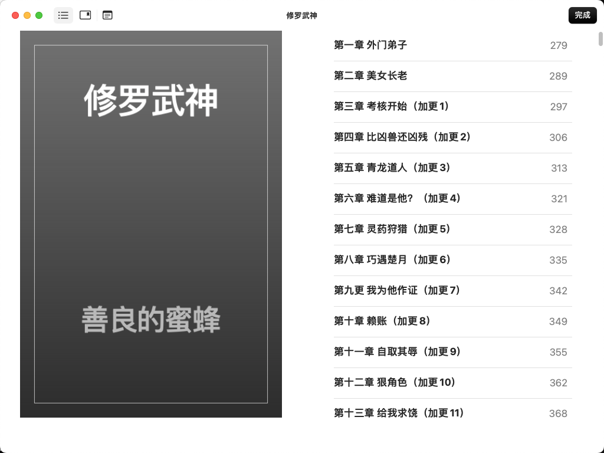

# Novel Spider

English | [中文](README.md)

**Novel Spider** is a Python-based web scraping project for 17k novel website, featuring one-click collection, resume capability, anti-crawling auto-switching, and data export to txt/epub formats. We recommend using the unified entry script `run.py`.

## 🚀 Features

This project includes the following main features:

1. **One-Click Automatic Novel Collection**
   - Use `run.py` script with commands:
     - `python run.py crawl auto_novel_top100`
     - `python run.py crawl auto_novel_top100_postgre`
   - Automatically scrape VIP ranking top 100 novels' basic info, chapter lists, and all chapter content from 17k novel website
   - Supports resume capability and anti-crawling auto-switching with Selenium
   - Data stored in `output/novel_data.db` (SQLite) or PostgreSQL (auto-detected via settings.py)

2. **One-Click Export to txt/epub**
   - Use `run.py` script with commands:
     - `python run.py export txt`
     - `python run.py export epub`
   - Automatically export all novels from database to txt or epub files
   - Supports intelligent chapter sorting and Chinese numeral recognition

3. **Database Auto-Adaptation**
   - Auto-detects `seventeen_novels/settings.py`, prioritizes PostgreSQL, otherwise uses SQLite
   - Automatic database table structure creation with upsert support

4. **Intelligent Chapter Sorting & Chinese Numeral Recognition**
   - Auto-recognizes chapter numbers during export, supports mixed sorting like "Chapter 12" and "Chapter 100"
   - Supports Chinese numeral to Arabic numeral conversion for accurate chapter ordering

5. **Environment & Dependency Auto-Management**
   - Auto-detects and activates virtual environment
   - ChromeDriver auto-management, no manual download required
   - Cross-platform support (Windows/macOS/Linux)

6. **Anti-Crawling Auto-Switching & Resume Capability**
   - Automatically switches to Selenium when encountering anti-crawling pages
   - Auto-skips already collected chapters, supports large-scale data collection

7. **Smart Logging System & Error Handling**
   - Structured log output with timestamps and operation status
   - Detailed error information and troubleshooting tips
   - Graceful error handling, won't crash due to single errors

8. **Docker Containerization Support**
   - Complete Dockerfile and docker-compose.yml provided
   - One-click deployment and execution
   - Optimized image with Chrome and ChromeDriver included

9. **Multiple Spider Modes**
   - `auto_novel_top100`: SQLite-supported automatic scraping of free ranking top 100 novels
   - `auto_novel_top100_postgre`: PostgreSQL-supported automatic scraping mode
   - `free_novel_top100`: Free novel ranking scraping
   - `novel_chapter_list`: Chapter list scraping
   - `novel_all_chapters`: Full chapter content scraping

10. **Unified Entry Script**
    - All functions managed through `run.py`
    - Supports command-line arguments and help information
    - Other entry scripts have been integrated, not recommended for individual use

## 📁 Project Structure

```
novel_spider/
├── seventeen_novels/           # Scrapy spider main module
│   ├── items.py               # Data model definitions
│   ├── pipelines.py           # Data processing pipelines
│   ├── settings.py            # Spider configuration
│   ├── middlewares.py         # Middleware
│   └── spiders/               # Spider scripts
│       ├── auto_novel_top100.py
│       ├── auto_novel_top100_postgre.py
│       ├── free_novel_top100.py
│       ├── novel_chapter_list.py
│       └── novel_all_chapters.py
├── output/                     # All data output directory
│   ├── novel_data.db           # SQLite database
│   ├── ebooks/                 # Exported txt/epub files
│   └── pgdata/                 # PostgreSQL data directory
├── run.py                      # One-click entry script (recommended)
├── run_export_to_ebooks.py     # Ebook export script
├── requirements.txt            # Python dependencies
├── Dockerfile                  # Docker image configuration
├── docker-compose.yml          # Docker Compose configuration
├── sample.env                  # Environment variables example
├── scrapy.cfg                  # Scrapy configuration file
└── README.md                   # Project documentation
```

## 📦 Dependencies

### Core Dependencies
- **scrapy>=2.13.2**: Web scraping framework
- **selenium>=4.33.0**: Browser automation
- **webdriver_manager>=4.0.2**: ChromeDriver auto-management
- **parsel>=1.10.0**: HTML/XML parsing
- **ebooklib>=0.19**: EPUB ebook generation
- **psycopg2-binary>=2.9.10**: PostgreSQL database connection

### System Requirements
- **Python**: 3.13.3 or higher
- **Chrome Browser**: For Selenium automation
- **Memory**: 4GB+ recommended
- **Storage**: 10GB+ available space recommended based on data collection volume

## 🔧 Installation & Setup

### 1. Clone the Repository
```bash
git clone https://github.com/WTFGEDelphia/novel_spider.git
cd novel_spider
git checkout main
```

### 2. Install Python Environment

Python 3.13.3 or higher recommended.

**Windows:**
1. Visit [Python Downloads](https://www.python.org/downloads/windows/)
2. Download the latest Python 3 installer (.exe)
3. Run the installer, **make sure to check "Add Python to PATH"**, then click "Install Now"
4. After installation, verify by running `python --version` or `py --version` in command prompt

**macOS:**
1. Recommended to use Homebrew:
   ```bash
   brew install python
   ```
2. Or visit [Python Downloads](https://www.python.org/downloads/macos/) to download .pkg installer
3. After installation, verify by running `python3 --version` in terminal

**Linux (Ubuntu/Debian):**
1. System usually comes with Python3, install/upgrade with:
   ```bash
   sudo apt update
   sudo apt install python3 python3-venv python3-pip
   ```
2. Verify installation:
   ```bash
   python3 --version
   ```

### 3. Create Virtual Environment & Install Dependencies

**Windows**
```cmd
py -m venv venv
venv\Scripts\activate
pip install -r requirements.txt
```

**macOS / Linux**
```bash
python3 -m venv venv
source venv/bin/activate
pip install -r requirements.txt
```

### 4. Configure Chrome Browser & Driver
- This project automatically uses `webdriver_manager` to manage ChromeDriver, no manual download required
- Requires Chrome browser installed locally

## ⚙️ Environment Variables & Database Configuration

### PostgreSQL Configuration (Optional)
1. Copy environment variables example file:
   ```bash
   cp sample.env .env
   ```

2. Edit `.env` file, set database connection parameters:
   ```bash
   PG_HOST=localhost
   PG_PORT=5432
   PG_USER=postgres
   PG_PASSWORD=your_password
   PG_DBNAME=novel_spider
   ```

3. If using PostgreSQL, ensure database is created and accessible

### SQLite Configuration (Default)
- No additional configuration required, data will be automatically saved to `output/novel_data.db`

## 🚀 Usage

### 1. One-Click Automatic Novel Collection

```bash
# Using SQLite database
python run.py crawl auto_novel_top100

# Using PostgreSQL database
python run.py crawl auto_novel_top100_postgre

# Local mode (skip ranking collection, directly collect chapter content)
python run.py crawl auto_novel_top100 --local
```

**Features:**
- Automatically scrapes rankings, chapter lists, and chapter content
- Supports resume capability, automatically skips already collected content
- Automatically switches to Selenium when encountering anti-crawling
- Real-time display of collection progress and status

### 2. One-Click Export to txt/epub

```bash
# Export to TXT format
python run.py export txt

# Export to EPUB format
python run.py export epub
```

**Features:**
- Automatically reads all novel data from database
- Supports intelligent chapter sorting
- Automatic Chinese numeral conversion
- Includes novel name, author, volume name, chapter name, and content

> 💡 **Quick Preview**: After export completion, you can directly double-click EPUB files on macOS to open with "Preview" app, or use other EPUB readers like Calibre.

## 📖 EPUB Export Preview

### macOS Preview Effect
Exported EPUB files opened with built-in "Preview" app on macOS:

#### Book Cover and Table of Contents


#### Chapter Navigation


#### Chapter Content Reading


### Export Features
- **Complete Chapter Structure**: Includes volume names, chapter names, and content
- **Intelligent Sorting**: Chapters automatically sorted by Chinese numerals
- **Author Information**: Complete display of novel author information
- **Good Compatibility**: Supports various EPUB readers (macOS Preview, Calibre, Kindle, etc.)

### 3. View Help Information

```bash
# View main help
python run.py --help

# View spider help
python run.py crawl --help

# View export help
python run.py export --help
```

## 🐳 Docker One-Click Deployment

### 1. Build Image
```bash
docker build -t novel_spider:latest .
```

### 2. Run Collection/Export Commands
```bash
# Collect novel rankings and content
docker run --rm -v $(pwd)/output:/app/output novel_spider:latest crawl auto_novel_top100

# Export epub
docker run --rm -v $(pwd)/output:/app/output novel_spider:latest export epub

# Export txt
docker run --rm -v $(pwd)/output:/app/output novel_spider:latest export txt
```

> `-v $(pwd)/output:/app/output` syncs the output directory in container with host for easy result access.

### 3. Docker Compose One-Click Deployment

**Start PostgreSQL and spider services:**
```bash
docker-compose up --build
```

**Run export commands:**
```bash
docker-compose run --rm spider python run.py export epub
docker-compose run --rm spider python run.py export txt
```

**Stop and cleanup:**
```bash
docker-compose down
```

## 🔍 Troubleshooting

### Common Issues

1. **Virtual Environment Not Found**
   ```bash
   # Ensure you're in project root directory
   python3 -m venv venv
   source venv/bin/activate  # Linux/macOS
   # or
   venv\Scripts\activate     # Windows
   ```

2. **ChromeDriver Download Failed**
   - Check network connection
   - Ensure Chrome browser is installed
   - Try manually downloading ChromeDriver and placing in project directory

3. **Database Connection Failed**
   - Check if PostgreSQL service is running
   - Verify connection parameters in `.env` file
   - Ensure database user has sufficient permissions

4. **Spider Blocked by Anti-Crawling**
   - Project will automatically switch to Selenium mode
   - Try reducing crawling frequency
   - Check network connection stability

5. **Export Failed**
   - Ensure there's data in the database
   - Check `output/ebooks/` directory permissions
   - Verify EPUB export requires `ebooklib` dependency

### Log Viewing
Project uses structured logging, all operations are recorded with detailed information:
- Timestamps and operation status
- Error information and stack traces
- Crawling progress and statistics

## 📊 Output File Description

### Database Files
- **SQLite**: `output/novel_data.db`
- **PostgreSQL**: Data stored in configured database

### Export Files
- **TXT Files**: `output/ebooks/*.txt`
- **EPUB Files**: `output/ebooks/*.epub`

### File Naming Rules
- Filename: Novel name (special characters will be filtered)
- Encoding: UTF-8
- Format: Includes novel information, chapter content, author information

## 🤝 Contributing

Welcome to submit Issues and Pull Requests!

1. Fork this project
2. Create a feature branch
3. Commit your changes
4. Push to the branch
5. Create a Pull Request

## 📄 License

MIT License

## 📞 Contact

For customized collection or other questions, welcome to:
- Submit [Issue](https://github.com/WTFGEDelphia/novel_spider/issues)
- Contact the author

---

**Note**: This project is for learning and research purposes only. Please comply with relevant website terms of use and laws and regulations. 